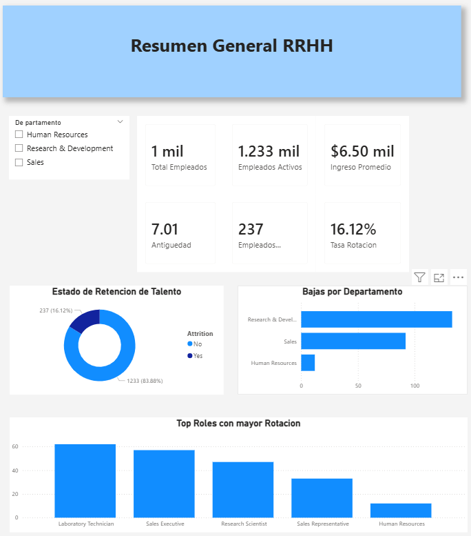
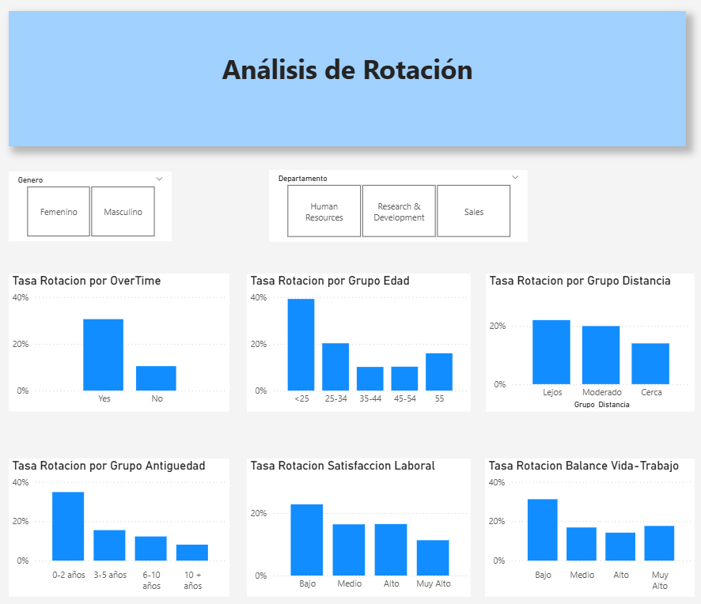
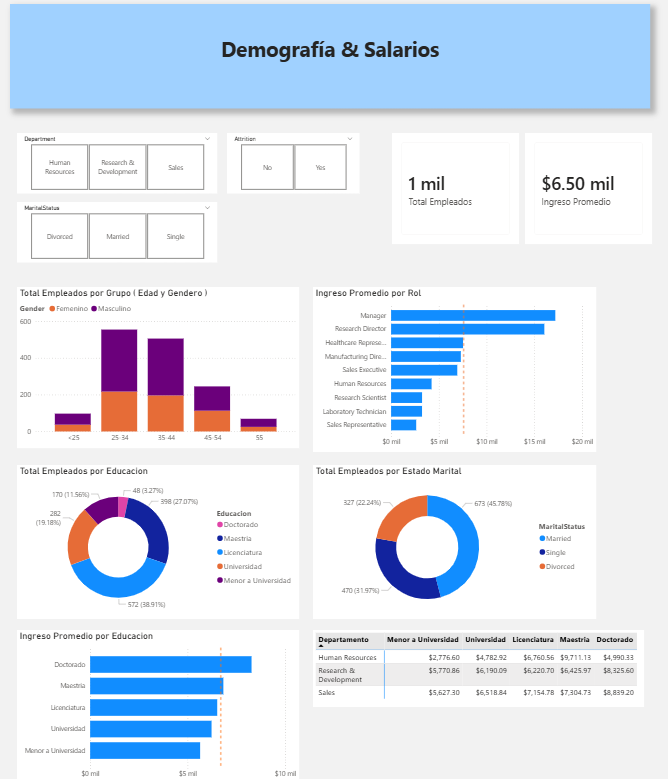

# 📊 Dashboard RRHH — IBM HR Analytics

## Descripción

Dashboard interactivo de 3 páginas construido en Power BI para analizar la rotación de empleados y la composición del personal. El objetivo es ayudar a RRHH a identificar **quiénes se van, por qué se van** y qué acciones tomar para retener talento.

## 🎯 Objetivo

Construir un dashboard ejecutivo de 3 páginas que permita a RRHH identificar patrones de rotación, entender la composición del personal y analizar la estructura salarial — todo con el fin de tomar decisiones informadas para retener talento.

## 📈 KPIs e Indicadores

| Indicador | Valor | Descripción |
|---|---|---|
| **Total Empleados** | 1,470 | Total de registros en la base |
| **Empleados Activos** | 1,233 | Empleados que permanecen en la empresa |
| **Empleados Inactivos** | 237 | Empleados que dejaron la empresa |
| **Tasa de Rotación** | 16.12% | KPI estrella — proporción de bajas vs total |
| **Ingreso Promedio** | $6,500 | Ingreso mensual promedio de la plantilla |
| **Antigüedad Promedio** | 7.01 años | Tiempo promedio de los empleados en la empresa |
| **Satisfacción Promedio** | 2.73 / 4 | Nivel promedio de satisfacción laboral |

## 🔍 Páginas del Dashboard

### Página 1 — Resumen General RRHH

Vista ejecutiva con los KPIs principales, donut de retención de talento (83.88% activos vs 16.12% inactivos), bajas por departamento y top roles con mayor rotación. Incluye slicer por departamento.



### Página 2 — Análisis de Rotación ⭐ (Página Estrella)
Analiza los factores asociados a la rotación usando **tasas porcentuales** para comparaciones justas entre grupos de diferente tamaño. Incluye análisis por OverTime, Grupo de Edad, Distancia, Antigüedad, Satisfacción Laboral y Balance Vida-Trabajo. Filtros por Género y Departamento.



### Página 3 — Demografía y Salarios
Composición del personal por edad y género, nivel de educación y estado marital. Estructura salarial por rol, educación y departamento. Incluye tooltip personalizado con distribución de ingreso por género. Filtros por Departamento, Attrition y Estado Marital.



## 💡 Hallazgos Clave

### Rotación
- **OverTime es el factor #1 de rotación:** ~30% para quienes hacen horas extra vs ~10% para quienes no.
- **Los menores de 25 años** tienen la tasa más alta (~38%), muy por encima del resto.
- **Empleados nuevos (0-2 años)** alcanzan ~36% de rotación, señalando un problema crítico en retención temprana.
- **Satisfacción baja** se asocia con ~22% de rotación.
- **Balance vida-trabajo bajo** muestra ~30% de rotación, reforzando el impacto de las condiciones laborales.

### Top Roles con Mayor Rotación
- Laboratory Technician y Sales Executive lideran en cantidad de bajas (~60 cada uno).
- Research Scientist y Sales Representative también presentan números significativos.

### Composición del Personal
- El grupo **25-34 años** es el más grande, con predominancia masculina.
- **Licenciatura** es el nivel más común (38.91%), seguido de Maestría (19.18%).
- **Casados** representan el 45.78%, Solteros 31.97% y Divorciados 22.24%.

### Salarios
- **Manager y Research Director** son los roles mejor pagados (+$15,000 mensuales).
- El ingreso crece con el nivel educativo: ~$4,500 (Menor a Universidad) hasta ~$8,000 (Doctorado).
- La tabla cruzada por departamento y educación muestra salarios competitivos en R&D y Sales para Maestría y Doctorado.

## 🛠️ Herramientas Utilizadas

- **Power BI Desktop** — Modelado de datos, visualización y diseño del dashboard
- **DAX (Data Analysis Expressions)** — Medidas calculadas para KPIs (Total Empleados, Tasa de Rotación, Ingreso Promedio, etc.)
- **Power Query** — Transformación y limpieza de datos, mapeo de valores numéricos a texto en español, creación de columnas agrupadas

## 📐 Medidas DAX

### Total Empleados
```dax
Total Empleados = COUNTROWS('WA_Fn-UseC_-HR-Employee-Attrition')
```

### Empleados Inactivos
```dax
Empleados Inactivos = 
CALCULATE(
    COUNTROWS('WA_Fn-UseC_-HR-Employee-Attrition'),
    'WA_Fn-UseC_-HR-Employee-Attrition'[Attrition] = "Yes"
)
```

### Tasa de Rotación (KPI Estrella)
```dax
Tasa Rotación = DIVIDE([Empleados Inactivos], [Total Empleados])
```

### Empleados Activos
```dax
Empleados Activos = [Total Empleados] - [Empleados Inactivos]
```

### Ingreso Mensual Promedio
```dax
Ingreso Promedio = AVERAGE('WA_Fn-UseC_-HR-Employee-Attrition'[MonthlyIncome])
```

## 🗂️ Modelo de Datos

- **Tabla principal:** WA_Fn-UseC_-HR-Employee-Attrition (1,470 filas, 31 columnas)
- **Role-Playing Dimensions:** Dim_Educacion, Dim_Satisfaccion, Dim_Balance, Dim_Ambiente — cada una conectada a una columna específica de la tabla principal para resolver el mapeo de escalas numéricas a texto
- **Tabla de medidas:** Contiene las 7 medidas DAX centrales del dashboard

## 📂 Estructura del Repositorio

```
📁 powerbi-hr-analytics/
├── 📄 README.md                     ← Este archivo
├── 📁 dashboard/
│   └── Dashboard_RRHH.pbix          ← Archivo de Power BI
├── 📁 datos/
│   └── WA_Fn-UseC_-HR-Employee-Attrition.csv  ← Dataset original
└── 📁 imagenes/
    ├── pagina1_resumen_general.png   ← Resumen General RRHH
    ├── pagina2_analisis_rotacion.png ← Análisis de Rotación
    └── pagina3_demografia_salarios.png ← Demografía y Salarios
```

## 📊 Fuente de Datos

- **Dataset:** IBM HR Analytics — Employee Attrition & Performance
- **Origen:** [Kaggle - IBM HR Analytics](https://www.kaggle.com/datasets/pavansubhasht/ibm-hr-analytics-attrition-dataset)
- **Registros:** 1,470 empleados
- **Columnas originales:** 35 (reducidas a 31 tras limpieza)
- **Campos principales:** Attrition, Age, Department, JobRole, MonthlyIncome, OverTime, JobSatisfaction, WorkLifeBalance, YearsAtCompany, Education, Gender, MaritalStatus, entre otros.

## 🚀 Cómo Usar Este Proyecto

1. Descarga el archivo `Dashboard_RRHH.pbix` de la carpeta `dashboard/`.
2. Ábrelo con Power BI Desktop (versión gratuita).
3. Los datos ya están incluidos dentro del archivo .pbix.
4. Usa los slicers de cada página para explorar los datos por departamento, género, estado marital o tipo de attrition.

## 👤 Autor

**Héctor** — Ingeniero en Logística (ESPOL) | En transición hacia Data Analytics & BI

- LinkedIn: https://www.linkedin.com/in/h%C3%A9ctor-alvarado-47672419b/
- GitHub: https://github.com/hector216

---

⭐ Si este proyecto te resultó útil, no dudes en darle una estrella al repositorio.
